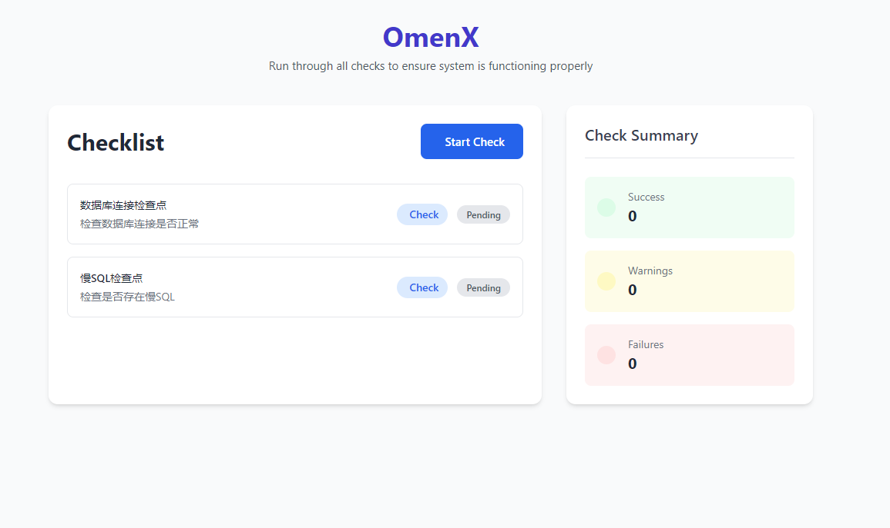
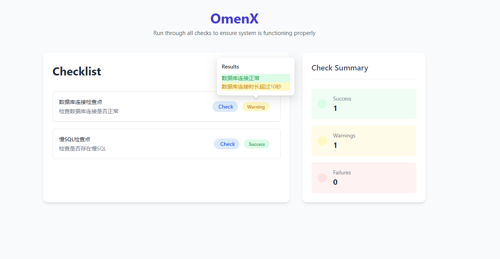
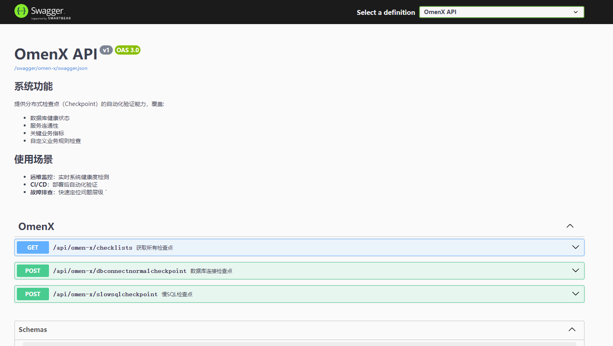

# OmenX  quick start

## Install 
```ps
dotnet add package OmenX --version 1.1.2
```

##  Integration

```cs 

var builder = WebApplication.CreateBuilder(args);
builder.Services.AddOmenX(typeof(Core).Assembly); // or builder.Services.AddOmenX();
// Other actions  
var app = builder.Build();
app.UseOmenX();
// Other actions  

```

### Development

#### Write down  any checkpoint  you want in Core Project

```cs

[CheckPointMetadata(Title = "Test check", Description = "Test check description")]
public class TestCheck : IOmenXCheckPoint
{
    public Task CheckAsync(OmeXCheckPointContext checkContext)
    {
        checkContext.Success(true, "test pass");
        return Task.CompletedTask;
    }
}

```


### Visit OmenX Check UI

```
Visit url like  https://[yourserver]/omenx-ui
```

### Start Check
- Click  Start Check Button to check all(one by one)
- Click Check button to check  one



### View Check Results




### Other features

- Configure swagger

```cs
builder.Services.AddSwaggerGen(options =>
{
    options.AddOmenXApiDoc();
});

app.UseSwaggerUI(options =>
{
    options.UseOmenXApiDoc();
})
```
- Visit swagger




 #### Write a checkpoint to detect problems early